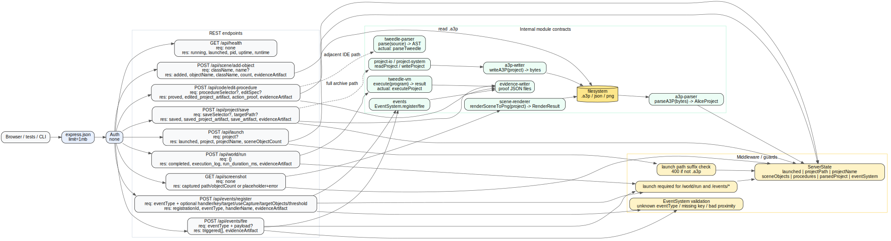

# API Contracts

This layer maps the Express REST surface in `src/server.ts` and the adjacent parser / writer / Tweedle contracts it depends on.

## REST surface

| Method | Path | Request shape | Success response shape | Guards / errors | Key collaborators |
| --- | --- | --- | --- | --- | --- |
| GET | `/api/health` | none | `{ status, launched, pid, uptime, runtime }` | none | in-memory `ServerState` |
| POST | `/api/launch` | `{ project?: string }` | `{ status: "launched", project, projectName, sceneObjectCount }` | `400 { error }` when requested project path is invalid, outside allowed dirs, missing, unreadable, or corrupt | `fs`, `parseA3P`, seeded scene objects |
| POST | `/api/scene/add-object` | `{ className: string, name?: string }` | `{ status: "added", objectName, className, sceneFieldCountAfter, evidenceArtifact }` | `400 { error: "className is required" }` | `ServerState.sceneObjects`, `writeSceneObjectAdded()` |
| POST | `/api/code/edit-procedure` | `{ procedureSelector?: string, editSpec?: string }` | `{ schema_version, status: "proved", procedure_selector, edited_project_artifact, action_proof, doesNotClaim, evidenceArtifact }` | no explicit validation beyond defaults | `ServerState.procedures`, `writeEditProcedureProof()` |
| POST | `/api/project/save` | `{ saveSelector?: string, targetPath?: string }` | `{ schema_version, status: "saved", save_selector, saved_project_artifact, save_artifact, evidenceArtifact }` | none | evidence dir, placeholder/copy `.a3p`, `writeSaveProof()` |
| POST | `/api/world/run` | `{}` | `{ schema_version, status: "completed", project_name, scene_object_count, procedure_count, statements_executed, execution_log, run_duration_ms, errors, doesNotClaim, evidenceArtifact }` | `400 { error: "Not launched. Call POST /api/launch first." }` | cached `AliceProject`, `executeProject()`, run evidence file |
| GET | `/api/screenshot` | none | success: `{ status: "captured", path, objectCount, sceneDescription, rendered: true }`; fallback: `{ status: "captured", path, placeholder: true, error }` | renderer exceptions fall back to placeholder PNG | `renderSceneToPng()` |
| POST | `/api/events/register` | `{ eventType, handlerName?, key?, target?, useCapture?, targetObjects?, threshold? }` | `{ registrationId, eventType, handlerName, evidenceArtifact }` | `400 { error }` when not launched or `EventSystem` rejects payload | `EventSystem.register()`, `writeEventRegister()` |
| POST | `/api/events/fire` | `{ eventType, payload?: { key?, code?, target?, path?, sourceObject?, altKey?, ctrlKey?, metaKey?, shiftKey?, button?, x?, y?, wheelRotation? } }` | `{ triggered: TriggeredEventHandler[], evidenceArtifact }` | `400 { error }` when not launched or `EventSystem` rejects payload | `EventSystem.fire()`, `writeEventFire()` |

## Auth and middleware chain

- **Auth:** none.
- **Global middleware:** `express.json({ limit: "1mb" })`.
- **Route-local guards:**
  - `/api/launch` rejects non-`.a3p` paths.
  - `/api/world/run` and `/api/events/*` require `state.launched === true`.
  - `/api/events/register` and `/api/events/fire` rely on `EventSystem` for payload validation and normalize `keyPress` to the internal `keyPressed` event family.
  - `/api/screenshot` falls back to a placeholder PNG instead of surfacing renderer exceptions.

## Internal module contracts

| Module | Atlas contract | Actual export used in code | Concrete signature in repo |
| --- | --- | --- | --- |
| `a3p-parser` | `parseA3P(bytes) → AliceProject` | `parseA3P` | `parseA3P(data: ArrayBuffer | Uint8Array): Promise<AliceProject>` |
| `a3p-writer` | `writeA3P(project) → bytes` | `writeA3P` | `writeA3P(project: AliceProject, options?): Promise<Uint8Array>` |
| `tweedle-parser` | `parse(source) → AST` | `parseTweedle` | `parseTweedle(source: string): ClassDecl` |
| `tweedle-vm` | `execute(program) → result` | `executeProject` | `executeProject(project: AliceProject): ExecutionResult` |

## Notes

- The REST server currently calls `parseA3P` and `executeProject` directly; `tweedle-parser` and `tweedle-codegen` are the richer authoring-side contracts used by the IDE pipeline rather than the current REST edit endpoint.
- `/api/project/save` is evidence-oriented in `src/server.ts` (copy existing `.a3p` or emit a placeholder), while the deeper project stack (`project-io` / `project-system`) owns the true archive serialization path via `writeA3P()`.
