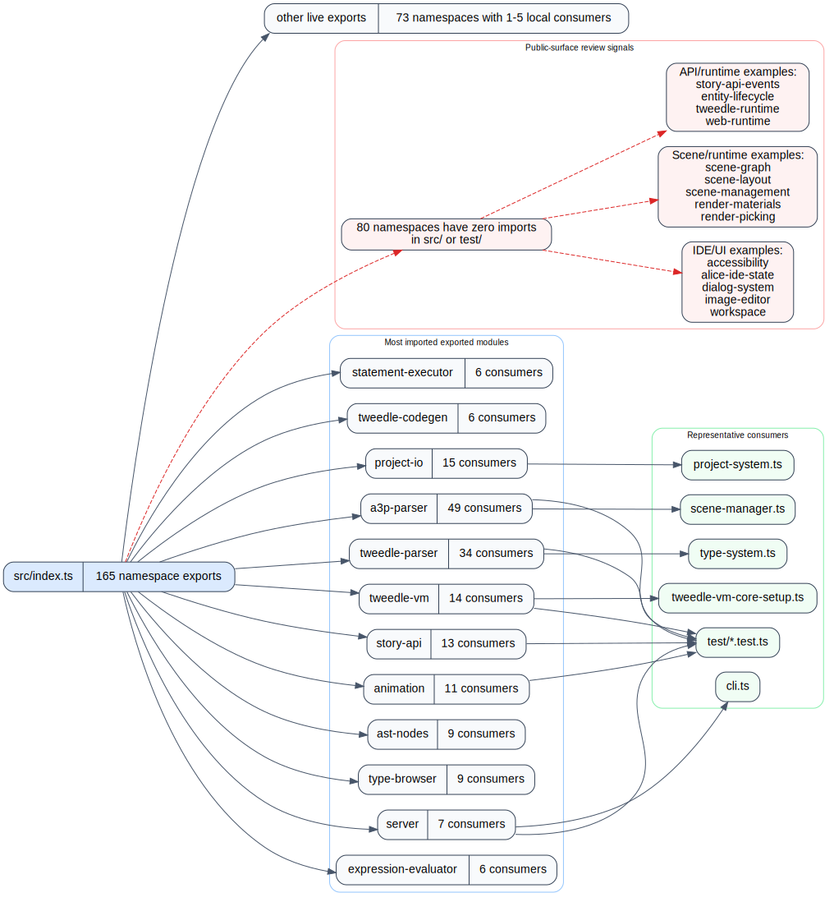

Mode: static-approximation

# AST+LSP Bindings

This layer approximates the public API surface by combining the `src/index.ts` barrel with in-repo import scanning across `src/` and `test/`.

## Barrel summary

- `src/index.ts` re-exports 165 namespaces.
- 85 exported namespaces have at least one local consumer.
- 80 exported namespaces are local dead-export candidates: they are exported from the barrel but never imported elsewhere in `src/` or `test/`.

## Most imported exported modules

| Exported namespace | Local consumers | Representative consumers |
| --- | ---: | --- |
| `a3p-parser` | 49 | `scene-manager.ts`, `project-export.ts`, `test/*.test.ts` |
| `tweedle-parser` | 34 | `type-system.ts`, `print-system.ts`, `test/*.test.ts` |
| `project-io` | 15 | `project-system.ts`, `project-manager.ts`, tests |
| `tweedle-vm` | 14 | `server.ts`, `tweedle-vm-core-setup.ts`, tests |
| `story-api` | 13 | runtime modules and tests |
| `animation` | 11 | story API wrappers, camera/runtime modules, tests |
| `ast-nodes` | 9 | editor/type modules and tests |
| `type-browser` | 9 | declaration/editor modules and tests |
| `server` | 7 | `cli.ts` and API/e2e tests |
| `expression-evaluator` | 6 | VM setup and virtual-machine tests |
| `statement-executor` | 6 | VM setup and virtual-machine tests |
| `tweedle-codegen` | 6 | print/compile flow and tests |

## Dead-export candidate notes

These are static-approximation candidates, not proven dead code. Likely buckets include:

- IDE/UI surfaces such as `accessibility`, `alice-ide-state`, `dialog-system`, `image-editor`, and `workspace`
- Scene/runtime surfaces such as `scene-graph`, `scene-layout`, `scene-management`, `render-materials`, and `render-picking`
- Runtime/API surfaces such as `story-api-events`, `entity-lifecycle`, `tweedle-runtime`, and `web-runtime`
- Project/helper surfaces such as `project-export`, `project-properties`, `project-statistics`, and `project-templates`
