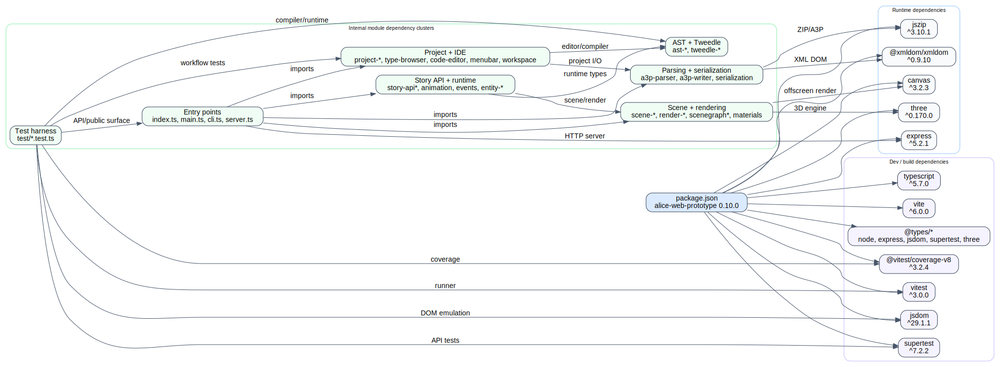

# Compile-time Dependencies

This layer combines `package.json` dependency inventory with a package-level approximation of internal import clusters.

## External dependencies

- Runtime dependencies are small and purpose-specific: `express` for the API, `three` + `canvas` for rendering, and `jszip` + `@xmldom/xmldom` for `.a3p` archive/XML handling.
- Dev dependencies split into build (`typescript`, `vite`), test (`vitest`, `@vitest/coverage-v8`, `jsdom`, `supertest`), and ambient typing packages.

## Internal dependency clusters

- Parsing/serialization is a shared base; `a3p-parser` is the most imported internal module (31 direct internal importers).
- AST/Tweedle modules form the densest compile-time cluster.
- Project/IDE modules depend on both parsing and AST/Tweedle layers.
- Story/runtime modules feed scene/rendering modules, while entry points bind those clusters to Express and the browser app.

## Circular dependency watch list

Representative root-file cycles detected by static import scanning:

- `ast-nodes-declarations-types` <-> `ast-nodes-declarations-runtime`
- `croquet-codec-core` <-> `croquet-action-operations`
- `tweedle-vm-builtins-dispatch` <-> `tweedle-vm-core-setup`
- `tweedle-parser-core-base` <-> `tweedle-parser-core-expressions` / `tweedle-parser-core-statements`

These cycles are not necessarily broken behavior, but they are the tightest coupling hotspots in the compile graph.
