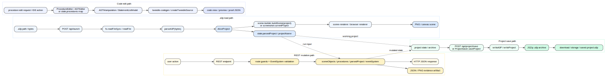

# Data Flow

This layer maps the main data transformations that move through the web prototype rather than just the modules that contain them.

## Core flows

- **`.a3p` load:** launch requests resolve a project path, read bytes from disk, parse them through `parseA3P()`, cache the resulting `AliceProject`, and then feed either screenshot rendering or the browser scene graph path.
- **Code edit:** the rich IDE path goes through `ProcedureEditor` / AST modules and emits Tweedle source via `tweedle-codegen`; the current REST proof endpoint keeps a lighter-weight `Map<string, string[]>` representation in `ServerState.procedures` and writes proof artifacts.
- **User action:** every REST mutation runs through JSON parsing, route-local validation, a `ServerState` mutation, and an evidence file write before returning JSON to the caller.
- **Project save:** the deeper archive pipeline serializes an `AliceProjectArchive` through `writeA3P()` / `writeProject()` into a JSZip-backed `.a3p` blob for download or storage.

## Important implementation nuance

- `src/server.ts` currently implements **evidence-oriented save/edit behavior** for the eatme flow: it copies an existing `.a3p` or writes a placeholder file, then emits JSON proof artifacts.
- The **full fidelity project round-trip** lives below the server in `project-io.ts`, `project-system.ts`, and `a3p-writer.ts`.
- The data-flow diagrams therefore show both the lightweight server path and the richer authoring / persistence path so the atlas stays anchored in current code truth.
