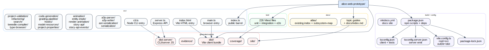

# Repository Surface

This layer maps the repository at directory and build-entry granularity rather than file-by-file.

## Structure summary

- `src/` is a mostly flat TypeScript codebase with 20 first-level subdirectories and a small set of root entry files: `index.ts`, `main.ts`, `server.ts`, `cli.ts`, and `index.html`.
- `test/` contains 226 Vitest suites spanning unit, integration, public API, and end-to-end coverage.
- `docs/` contains topic guides plus an older atlas surface (`docs/atlas/index.md`, `docs/atlas/subsystem-map.md`) that this structural atlas now complements.
- Build outputs split cleanly between `dist/` (Vite client bundle) and `dist-server/` (server/CLI emit from `tsconfig.server.json`).

## Build system and config

- `package.json` drives `npm run build`, `npm run build:server`, and `npm test`.
- `vite.config.ts` points the client build at `src/` and emits browser assets into `dist/`.
- `tsconfig.json` covers client code and tests; `tsconfig.server.json` emits the Node server/CLI bundle into `dist-server/`.
- `mkdocs.yml` publishes the documentation site from `docs/`.
