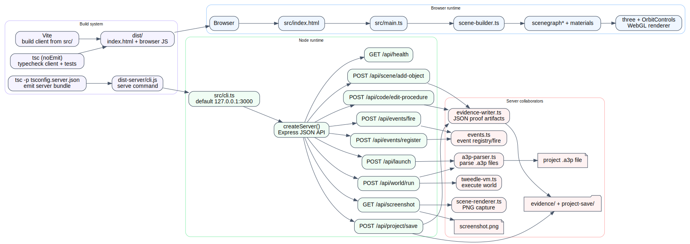

# Runtime Topology

This layer maps the running browser app, the Node/Express API process, and the build pipeline that produces both artifacts.

## Server shape

- `src/cli.ts` is the process entry for `lookingglass serve`; it binds the API to `127.0.0.1:3000` by default and passes `evidenceDir` / `project` options into `createServer()`.
- `src/server.ts` exposes 9 REST endpoints: launch, health, scene mutation, code edit, save, run, screenshot, event register, and event fire.
- The server collaborates with `a3p-parser.ts`, `scene-renderer.ts`, `tweedle-vm.ts`, `events.ts`, and `evidence-writer.ts` plus filesystem-backed `.a3p`, JSON, and PNG artifacts.

## Client shape

- `src/index.html` loads `src/main.ts` as the browser entry.
- `src/main.ts` builds a viewer pipeline around `scene-builder.ts`, scenegraph/material helpers, and `three`'s WebGL renderer.
- The browser app is built by Vite; the Express server does not serve the Vite client directly in `src/server.ts`.

## Build path

- `vite` emits browser assets to `dist/`.
- `tsc -p tsconfig.server.json` emits the CLI/server bundle to `dist-server/`.
- `npm run build` and `npm run build:server` therefore produce two runtime artifacts: a browser bundle and a local-only JSON API server.
