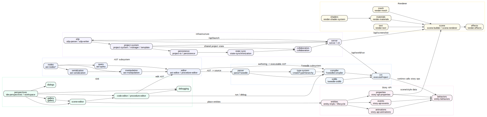

# Service Components

This layer splits the internal architecture into six Mermaid subsystem diagrams so each stays readable. The single DOT overview shows the cross-subsystem coupling.

## Tweedle subsystem

Representative files: `tweedle-parser*.ts`, `tweedle-compiler.ts`, `tweedle-type-system.ts`, `tweedle-stdlib*.ts`, `tweedle-vm*.ts`, `tweedle-runtime.ts`.

## AST subsystem

Representative files: `ast-nodes*.ts`, `ast-serialization.ts`, `ast-manipulation.ts`, `ast-query.ts`, `ast-editor.ts`, `procedure-editor.ts`, `code-editor.ts`.

## Story API subsystem

Representative files: `entity-impls.ts`, `entity-lifecycle.ts`, `story-api-animations.ts`, `story-api-events.ts`, `story-api-properties.ts`, `entity-behaviors.ts`.

## Renderer subsystem

Representative files: `render-pipeline.ts`, `render-materials.ts`, `render-shader-system.ts`, `render-effects.ts`, `render-text.ts`, `render-mesh.ts`, `scene-builder.ts`, `scene-renderer.ts`.

## IDE subsystem

Representative files: `ide-perspectives.ts`, `workspace.ts`, `gallery.ts`, `scene-editor.ts`, `code-editor.ts`, `procedure-editor.ts`, `debugging.ts`, `dialog-system.ts`.

## Infrastructure subsystem

Representative files: `a3p-parser.ts`, `a3p-writer.ts`, `project-system.ts`, `project-manager.ts`, `project-io.ts`, `persistence.ts`, `state-synchronization.ts`, `collaboration.ts`, `server.ts`.

`a3p-parser` / `a3p-writer` is a shared project-model hub used by the server, project-system, renderer, runtime hooks, and IDE/workspace code. `collaboration.ts` stays in-memory; it is not wired into `src/server.ts` or exposed as a REST surface.

## Cross-subsystem coupling notes

- IDE editing flows into AST manipulation, then into Tweedle compile / run paths.
- Story entities and properties are the semantic layer the renderer turns into meshes, materials, text, and effects.
- Infrastructure owns project archives, persistence, and in-memory collaboration; the REST server only wires the launch / run / screenshot API paths shown in `src/server.ts`.
