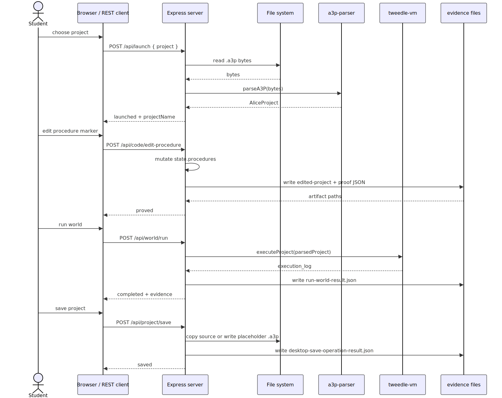
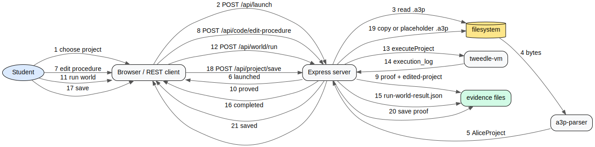
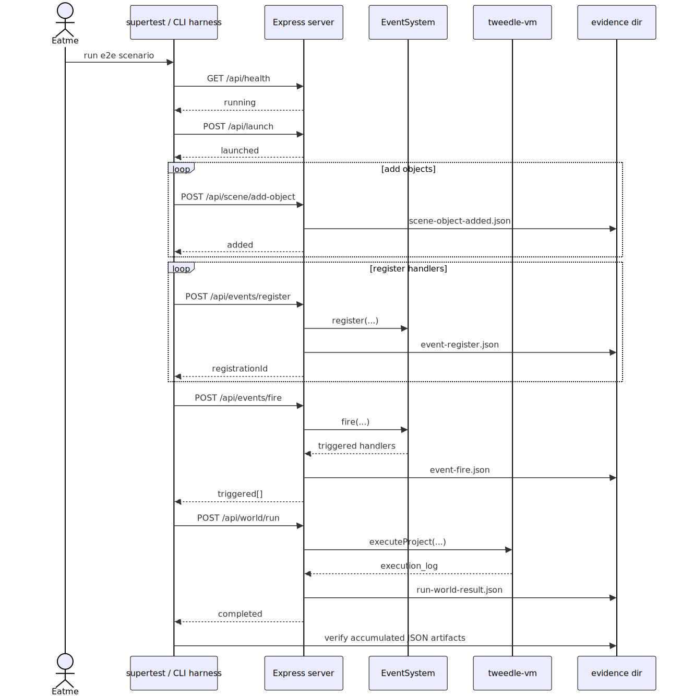
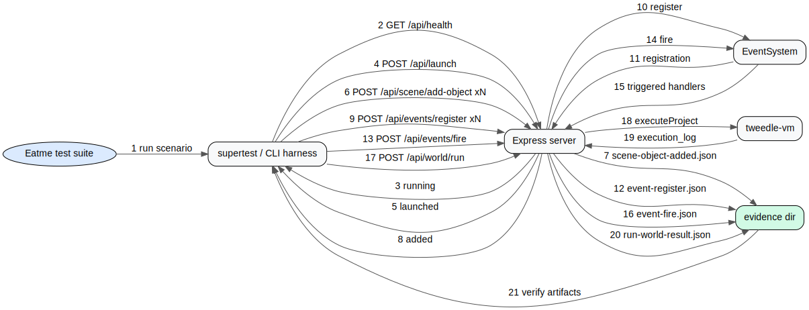
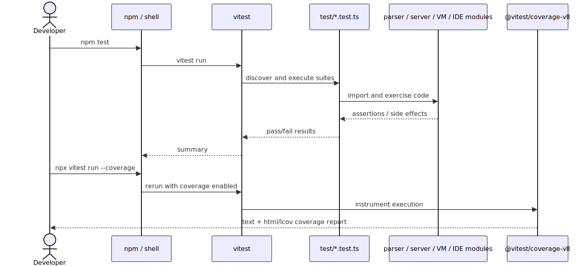
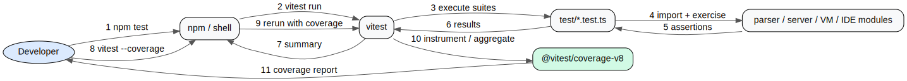
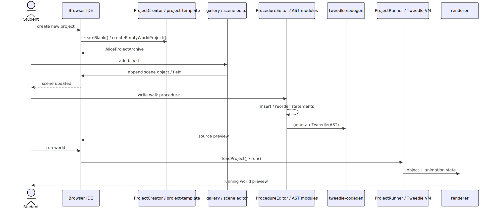
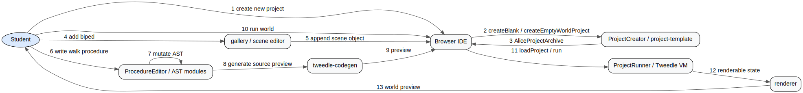
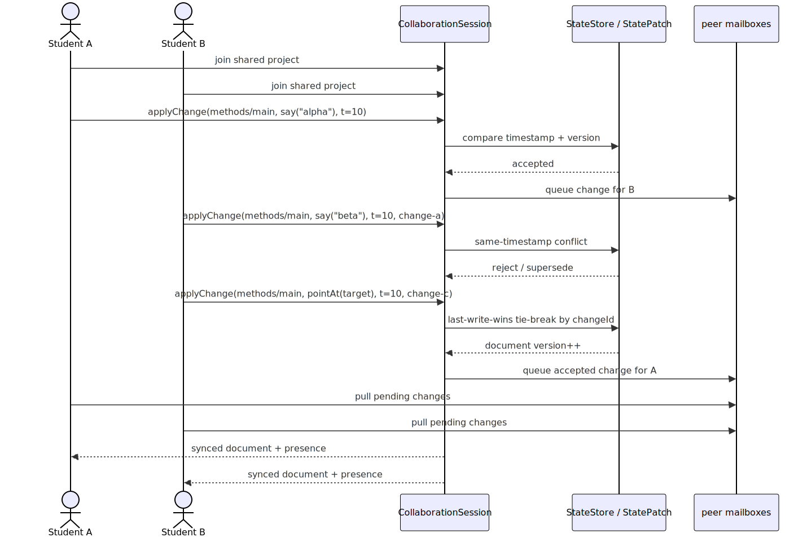
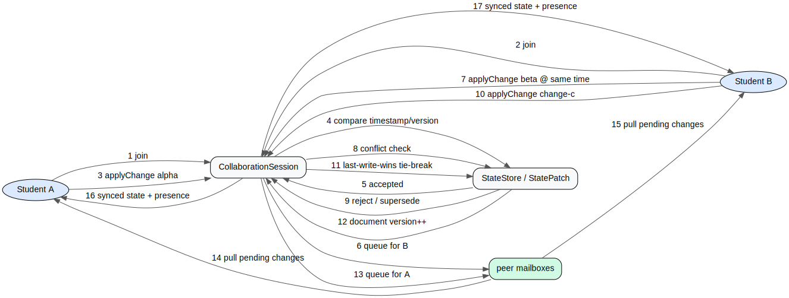

# User Journeys

This layer traces the main end-to-end paths that cut across the behavioral stack.

## 1. Student loads project via REST, edits, runs, saves

Anchored in `src/server.ts`, `test/server.test.ts`, and `test/silver-thread-e2e.test.ts`.

## 2. Eatme suite drives the prototype

Anchored in `test/advanced-e2e.test.ts`, `test/events.test.ts`, and the evidence-writing endpoints in `src/server.ts`.

## 3. Developer runs tests and coverage

Anchored in `package.json` (`npm test -> vitest run`) plus the installed coverage provider `@vitest/coverage-v8`.

## 4. Student creates a new project, adds a biped, writes a walk procedure, runs

Anchored in `project-template.ts`, `project-system.ts`, `gallery.ts`, `procedure-editor.ts`, `tweedle-codegen.ts`, and `project-runner.ts`.

## 5. Collaborative editing with sync and conflict resolution

Anchored in `collaboration.ts`, `state-synchronization.ts`, and `test/collaboration.test.ts`.
