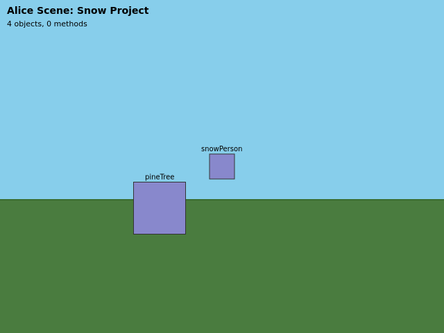

# Tutorial: Building Your First Alice Application

This hands-on tutorial walks you through building an Alice 3D application from
scratch using the Alice REST API. You will create a
project from a template, populate a scene with objects, write code, run
the world, wire up events, capture screenshots, and save your work — all
from the command line.

The request and response shapes below use the Alice / `alice-web` identity
contract. You can reproduce them by following the steps in order.

> **Note on screenshots:** The scene renderer currently produces the same
> base rendering regardless of scene state — scene-graph mutations (adding
> objects, editing code) are tracked in the API model but not yet reflected
> in the Three.js render pass. Screenshots at different tutorial stages may
> therefore look identical. This will improve as the renderer gains full
> scene-graph integration.

## Prerequisites

| Requirement | Version |
| --- | --- |
| Node.js | 18 or later |
| npm | 9 or later |
| curl | any recent version |
| A clone of this repository | current `main` branch |

Install dependencies and build the server:

```bash
npm install
npm run build:server
```

## Step 0 — Start the server

Launch the API server on port 3000 (the default):

```bash
npm run build:server
export ALICE_LOCAL_API_TOKEN="$(node -e 'console.log(require("crypto").randomBytes(32).toString("base64url"))')"
npm run serve -- --api-token "$ALICE_LOCAL_API_TOKEN"
# or, with explicit options:
npm run serve -- --port 3000 --evidence-dir ./evidence --api-token "$ALICE_LOCAL_API_TOKEN"
```

You should see output indicating the server is listening. Leave this
terminal open and use a second terminal for the `curl` commands below.
Export the same `ALICE_LOCAL_API_TOKEN` value in that second terminal; mutating
requests use it in `X-Alice-Local-Api-Token`.

## Step 1 — Health check

Confirm the server is alive:

```bash
curl http://127.0.0.1:3000/api/health
```

Response:

```json
{
  "status": "running",
  "launched": false,
  "pid": 48291,
  "uptime": 1.42,
  "runtime": "alice-web"
}
```

The key field is `"launched": false` — the server is up but no project session is active yet. The `runtime` value is the Alice web runtime identity, and the `pid` and `uptime` values will differ on your machine.


## Step 2 — Browse project templates

Before creating a project, see what starter templates are available:

```bash
curl http://127.0.0.1:3000/api/project/templates
```

Response:

```json
{
  "templates": [
    {
      "id": "blank",
      "name": "Blank",
      "description": "Minimal starter scene with a camera and ground."
    },
    {
      "id": "snow",
      "name": "Snow",
      "description": "Snowy starter world with a camera, snowperson, and pine tree."
    },
    {
      "id": "sea-floor",
      "name": "Sea Floor",
      "description": "Underwater starter scene with fish, coral, and treasure."
    },
    {
      "id": "moon",
      "name": "Moon",
      "description": "Low-gravity moon scene with a rover and astronaut."
    }
  ]
}
```

Four templates ship out of the box. We will use `snow` for this tutorial.

## Step 3 — Create a new project

Create a project from the `snow` template:

```bash
curl -X POST http://127.0.0.1:3000/api/project/new \
  -H "X-Alice-Local-Api-Token: $ALICE_LOCAL_API_TOKEN" \
  -H 'Content-Type: application/json' \
  -d '{"templateId": "snow"}'
```

Response:

```json
{
  "schema_version": "eatme.alice-project-new-result/v1",
  "status": "created",
  "templateId": "snow",
  "projectName": "Snow Project",
  "projectPath": "evidence/project-new/Snow Project.a3p",
  "sceneObjectCount": 4,
  "a3pSizeBytes": 7251
}
```

> **Note:** You can optionally pass `"projectName": "WinterStory"` to
> override the default name.

The server created a valid `.a3p` archive on disk, initialized the scene
with 4 objects (ground, camera, snowPerson, pineTree), and set the
server's active session to this project.

> **Tip:** If you pass an invalid `templateId`, the server returns a `400`
> with a list of valid template IDs:
>
> ```json
> {
>   "error": "Unknown template: forest",
>   "availableTemplates": ["blank", "snow", "sea-floor", "moon"]
> }
> ```

## Step 4 — Take a screenshot of the initial scene

Capture the starting state before making changes:

```bash
curl -X POST http://127.0.0.1:3000/api/screenshot \
  -H "X-Alice-Local-Api-Token: $ALICE_LOCAL_API_TOKEN" \
  -H 'Content-Type: application/json' \
  -d '{}'
```

Response:

```json
{
  "status": "captured",
  "path": "evidence/screenshot.png",
  "objectCount": 2,
  "sceneDescription": "snowPerson(SBiped), pineTree(STree)",
  "rendered": true
}
```

The server rendered the scene to `evidence/screenshot.png` using its
built-in 2D scene renderer. The `objectCount` reflects rendered objects
(excluding camera and ground). Copy this file to your docs if you want
to keep it:

```bash
cp evidence/screenshot.png docs/screenshots/01-initial-snow-scene.png
```



## Step 5 — Add a fox to the scene

Add a fox character to make the story more interesting:

```bash
curl -X POST http://127.0.0.1:3000/api/scene/add-object \
  -H "X-Alice-Local-Api-Token: $ALICE_LOCAL_API_TOKEN" \
  -H 'Content-Type: application/json' \
  -d '{"className": "Fox"}'
```

Response:

```json
{
  "status": "added",
  "objectName": "fox",
  "className": "Fox",
  "sceneFieldCountAfter": 5,
  "evidenceArtifact": "evidence/scene-object-added.json"
}
```

The scene now has 5 objects. The `evidenceArtifact` path points to a JSON
file that records exactly what was added and when — useful for automated
grading pipelines.

## Step 6 — Write code in myFirstMethod

Add an instruction to the default `myFirstMethod` procedure. In Alice,
code is edited by appending statements:

```bash
curl -X POST http://127.0.0.1:3000/api/code/edit-procedure \
  -H "X-Alice-Local-Api-Token: $ALICE_LOCAL_API_TOKEN" \
  -H 'Content-Type: application/json' \
  -d '{
    "procedureSelector": "scene.myFirstMethod",
    "editSpec": "append-comment:fox turns to face the snowPerson"
  }'
```

Response:

```json
{
  "schema_version": "eatme.alice-first-lesson-code-editor-action-proof-result/v1",
  "status": "proved",
  "procedure_selector": "scene.myFirstMethod",
  "edited_project_artifact": "edited-project.a3p",
  "action_proof": "first-lesson-code-editor-action-proof.json",
  "doesNotClaim": [
    "first-lesson completion",
    "grading",
    "creative assessment",
    "visible rendering correctness",
    "broad UI automation"
  ],
  "evidenceArtifact": "evidence/first-lesson-code-editor-action-proof.json"
}
```

The `doesNotClaim` array is part of the evidence schema — it documents
the limits of what this proof artifact represents, so downstream
consumers never over-interpret it.

## Step 7 — Run the world

Execute the project through the Tweedle VM:

```bash
curl -X POST http://127.0.0.1:3000/api/world/run \
  -H "X-Alice-Local-Api-Token: $ALICE_LOCAL_API_TOKEN" \
  -H 'Content-Type: application/json' \
  -d '{}'
```

Response:

```json
{
  "schema_version": "eatme.alice-run-world-result/v1",
  "status": "completed",
  "project_name": "Snow Project",
  "scene_object_count": 5,
  "procedure_count": 1,
  "statements_executed": 0,
  "execution_log": [],
  "run_duration_ms": 1,
  "errors": [],
  "doesNotClaim": [
    "visible rendering correctness",
    "desktop run-button proof"
  ],
  "evidenceArtifact": "evidence/run-world-result.json"
}
```

The project runs without errors. `statements_executed` is 0 because
the comment we appended is not an executable statement — it is a proof
marker. A project with real Tweedle `doInOrder` / `doTogether` blocks
would report actual execution counts here. The `doesNotClaim` array
documents the limits of this evidence artifact, just like the
edit-procedure proof.

## Step 8 — Take a screenshot after adding the fox

Capture the scene again to see the fox:

```bash
curl -X POST http://127.0.0.1:3000/api/screenshot \
  -H "X-Alice-Local-Api-Token: $ALICE_LOCAL_API_TOKEN" \
  -H 'Content-Type: application/json' \
  -d '{}'
```

Response:

```json
{
  "status": "captured",
  "path": "evidence/screenshot.png",
  "objectCount": 2,
  "sceneDescription": "snowPerson(SBiped), pineTree(STree)",
  "rendered": true
}
```

```bash
cp evidence/screenshot.png docs/screenshots/03-scene-with-fox.png
```


Notice the scene still renders the same visible objects via the server-side
2D renderer. The fox was added to the scene graph but the renderer only
draws objects with known resource types.

## Step 9 — Register an event handler

Wire up a `sceneActivated` event that fires when the world starts:

```bash
curl -X POST http://127.0.0.1:3000/api/events/register \
  -H "X-Alice-Local-Api-Token: $ALICE_LOCAL_API_TOKEN" \
  -H 'Content-Type: application/json' \
  -d '{"eventType": "sceneActivated", "handlerName": "onWorldStart"}'
```

Response:

```json
{
  "registrationId": "evt-1",
  "eventType": "sceneActivated",
  "handlerName": "onWorldStart",
  "evidenceArtifact": "evidence/event-register.json"
}
```

The registration ID `evt-1` is assigned sequentially. You can register
multiple handlers for different event types — see the
[event system documentation](event-system.md) for the full list.

## Step 10 — Fire the event

Simulate the scene activation:

```bash
curl -X POST http://127.0.0.1:3000/api/events/fire \
  -H "X-Alice-Local-Api-Token: $ALICE_LOCAL_API_TOKEN" \
  -H 'Content-Type: application/json' \
  -d '{"eventType": "sceneActivated", "payload": {}}'
```

Response:

```json
{
  "triggered": [
    {
      "id": "evt-1",
      "eventType": "sceneActivated",
      "handlerName": "onWorldStart"
    }
  ],
  "evidenceArtifact": "evidence/event-fire.json"
}
```

The `triggered` array lists every handler that matched. Our
`onWorldStart` handler was invoked.

## Step 11 — Save the project

Save everything to a portable `.a3p` archive:

```bash
curl -X POST http://127.0.0.1:3000/api/project/save \
  -H "X-Alice-Local-Api-Token: $ALICE_LOCAL_API_TOKEN" \
  -H 'Content-Type: application/json' \
  -d '{"saveSelector": "scene.myFirstMethod"}'
```

Response:

```json
{
  "schema_version": "eatme.alice-project-save-result/v1",
  "status": "saved",
  "save_selector": "scene.myFirstMethod",
  "saved_project_artifact": "saved-project.a3p",
  "save_artifact": "desktop-save-operation-result.json",
  "evidenceArtifact": "evidence/project-save/desktop-save-operation-result.json"
}
```

The saved `.a3p` file is a standard ZIP archive that can be opened in
Alice 3 desktop or re-loaded into the web prototype via `POST /api/launch`.

Take a final screenshot to document the completed state:

```bash
curl -X POST http://127.0.0.1:3000/api/screenshot \
  -H "X-Alice-Local-Api-Token: $ALICE_LOCAL_API_TOKEN" \
  -H 'Content-Type: application/json' \
  -d '{}'
cp evidence/screenshot.png docs/screenshots/07-final-saved-project.png
```


## Complete workflow summary

| Step | Endpoint | Purpose |
| --- | --- | --- |
| 1 | `GET /api/health` | Verify server is running |
| 2 | `GET /api/project/templates` | Browse available templates |
| 3 | `POST /api/project/new` | Create project from template |
| 4 | `POST /api/screenshot` | Capture initial scene |
| 5 | `POST /api/scene/add-object` | Add a fox to the scene |
| 6 | `POST /api/code/edit-procedure` | Write code in myFirstMethod |
| 7 | `POST /api/world/run` | Execute the project |
| 8 | `POST /api/screenshot` | Capture scene with fox |
| 9 | `POST /api/events/register` | Wire up sceneActivated event |
| 10 | `POST /api/events/fire` | Simulate event firing |
| 11 | `POST /api/project/save` | Save the completed project |

## Scripting the full workflow

Here is the entire tutorial as a single shell script you can run
end-to-end:

```bash
#!/usr/bin/env bash
set -euo pipefail
BASE=http://127.0.0.1:3000
TOKEN_HEADER="X-Alice-Local-Api-Token: $ALICE_LOCAL_API_TOKEN"

echo "=== Health check ==="
curl -s "$BASE/api/health" | jq .

echo "=== List templates ==="
curl -s "$BASE/api/project/templates" | jq .

echo "=== Create project from snow template ==="
curl -s -X POST "$BASE/api/project/new" \
  -H "$TOKEN_HEADER" \
  -H 'Content-Type: application/json' \
  -d '{"templateId":"snow"}' | jq .

echo "=== Screenshot: initial scene ==="
curl -s -X POST "$BASE/api/screenshot" -H "$TOKEN_HEADER" -H 'Content-Type: application/json' -d '{}' | jq .
cp evidence/screenshot.png docs/screenshots/01-initial-snow-scene.png

echo "=== Add fox ==="
curl -s -X POST "$BASE/api/scene/add-object" \
  -H "$TOKEN_HEADER" \
  -H 'Content-Type: application/json' \
  -d '{"className":"Fox"}' | jq .

echo "=== Edit procedure ==="
curl -s -X POST "$BASE/api/code/edit-procedure" \
  -H "$TOKEN_HEADER" \
  -H 'Content-Type: application/json' \
  -d '{"procedureSelector":"scene.myFirstMethod","editSpec":"append-comment:fox turns to face the snowPerson"}' | jq .

echo "=== Run world ==="
curl -s -X POST "$BASE/api/world/run" \
  -H "$TOKEN_HEADER" \
  -H 'Content-Type: application/json' -d '{}' | jq .

echo "=== Screenshot: with fox ==="
curl -s -X POST "$BASE/api/screenshot" -H "$TOKEN_HEADER" -H 'Content-Type: application/json' -d '{}' | jq .
cp evidence/screenshot.png docs/screenshots/03-scene-with-fox.png

echo "=== Register event ==="
curl -s -X POST "$BASE/api/events/register" \
  -H "$TOKEN_HEADER" \
  -H 'Content-Type: application/json' \
  -d '{"eventType":"sceneActivated","handlerName":"onWorldStart"}' | jq .

echo "=== Fire event ==="
curl -s -X POST "$BASE/api/events/fire" \
  -H "$TOKEN_HEADER" \
  -H 'Content-Type: application/json' \
  -d '{"eventType":"sceneActivated","payload":{}}' | jq .

echo "=== Save project ==="
curl -s -X POST "$BASE/api/project/save" \
  -H "$TOKEN_HEADER" \
  -H 'Content-Type: application/json' \
  -d '{"saveSelector":"scene.myFirstMethod"}' | jq .

echo "=== Screenshot: final ==="
curl -s -X POST "$BASE/api/screenshot" -H "$TOKEN_HEADER" -H 'Content-Type: application/json' -d '{}' | jq .
cp evidence/screenshot.png docs/screenshots/07-final-saved-project.png

echo "Done! All 11 steps completed."
```

## Using alternative templates

The tutorial used `snow`, but you can substitute any template. Here are
`curl` examples for each:

**Blank** — an empty scene:

```bash
curl -X POST http://127.0.0.1:3000/api/project/new \
  -H "X-Alice-Local-Api-Token: $ALICE_LOCAL_API_TOKEN" \
  -H 'Content-Type: application/json' \
  -d '{"templateId": "blank", "projectName": "MyBlankProject"}'
```

**Sea Floor** — an underwater scene with fish, coral, and treasure:

```bash
curl -X POST http://127.0.0.1:3000/api/project/new \
  -H "X-Alice-Local-Api-Token: $ALICE_LOCAL_API_TOKEN" \
  -H 'Content-Type: application/json' \
  -d '{"templateId": "sea-floor", "projectName": "OceanAdventure"}'
```

**Moon** — a lunar scene with a rover and astronaut:

```bash
curl -X POST http://127.0.0.1:3000/api/project/new \
  -H "X-Alice-Local-Api-Token: $ALICE_LOCAL_API_TOKEN" \
  -H 'Content-Type: application/json' \
  -d '{"templateId": "moon", "projectName": "LunarExploration"}'
```

## Key concepts

### Projects and templates

An Alice project is a `.a3p` file — a ZIP archive containing scene data,
class definitions, and Tweedle source code. The web prototype manages
project state in memory and can serialize it to `.a3p` on save.

Templates are pre-built starting points. The `TemplateLibrary` ships
with four built-in templates (blank, snow, sea-floor, moon). Custom
templates can be registered when using the template library in code, but
the Server API does not provide an endpoint for registering them over HTTP.

### Scene objects

Every visible entity in an Alice world is a scene object with a class
name (e.g., `SBiped`, `SQuadruped`, or the full form
`org.lgna.story.SBiped`) and a position in 3D space. The
`POST /api/scene/add-object` endpoint adds objects to the current
scene — you can pass a short name like `"Fox"` or the fully qualified
Java class name.

### Procedures and code editing

Alice code lives in *procedures* — named methods attached to the scene.
Every new project starts with `myFirstMethod`. The
`POST /api/code/edit-procedure` endpoint appends statements to a
procedure and produces an evidence artifact documenting the edit.

### The Tweedle VM

`POST /api/world/run` executes the project through a TypeScript
implementation of the Tweedle virtual machine. The VM processes
`doInOrder`, `doTogether`, method calls, and other Tweedle constructs,
reporting execution counts and any errors.

### Events

The event system supports scene activation, keyboard events, mouse
events, proximity detection, collision, and more. Register handlers with
`POST /api/events/register`, then fire events with
`POST /api/events/fire`.

### Evidence artifacts

Most endpoints produce *evidence artifacts* — JSON files that record
exactly what happened. These are designed for automated grading
pipelines (`eatme`) that verify student work without requiring GUI
screenshots. The `doesNotClaim` field in each artifact explicitly
documents what the proof does *not* prove.

## Troubleshooting

### Server won't start

**Symptom:** `Error: Cannot find module './dist-server/cli.js'`

**Fix:** You need to build the server first:

```bash
npm run build:server
```

### `canvas` native dependency fails

**Symptom:** `Error: The module 'canvas' was compiled against a different Node.js version`

**Fix:** Rebuild native modules:

```bash
npm rebuild canvas
```

Or if that fails, reinstall:

```bash
rm -rf node_modules
npm install
```

### Port already in use

**Symptom:** `Error: listen EADDRINUSE :::3000`

**Fix:** Either kill the existing process or use a different port:

```bash
node dist-server/cli.js serve --port 3001 --evidence-dir ./evidence --api-token "$ALICE_LOCAL_API_TOKEN"
```

Then update all `curl` commands to use `http://127.0.0.1:3001`.

### "Not launched" error from /api/world/run

**Symptom:**

```json
{ "error": "Not launched. Call POST /api/launch first." }
```

**Fix:** Either call `POST /api/launch` to start a session, or use
`POST /api/project/new` which implicitly launches the session. The
tutorial uses `POST /api/project/new` (Step 3), which sets
`state.launched = true` automatically.

### Event registration fails

**Symptom:**

```json
{ "error": "eventType is required" }
```

**Fix:** Ensure your JSON body includes both `eventType` and
`handlerName`:

```bash
curl -X POST http://127.0.0.1:3000/api/events/register \
  -H "X-Alice-Local-Api-Token: $ALICE_LOCAL_API_TOKEN" \
  -H 'Content-Type: application/json' \
  -d '{"eventType": "sceneActivated", "handlerName": "myHandler"}'
```

### Keyboard event requires `key` field

**Symptom:**

```json
{ "error": "key is required for keyPress events" }
```

**Fix:** Add the `key` field for keyboard event types:

```bash
curl -X POST http://127.0.0.1:3000/api/events/register \
  -H "X-Alice-Local-Api-Token: $ALICE_LOCAL_API_TOKEN" \
  -H 'Content-Type: application/json' \
  -d '{"eventType": "keyPress", "handlerName": "onJump", "key": "SPACE"}'
```

### Screenshot returns a placeholder

**Symptom:** The response includes `"placeholder": true` instead of
`"rendered": true`.

**Fix:** This means the `canvas` native module could not render the
scene. Verify that `canvas` is installed correctly:

```bash
node -e "require('canvas')"
```

If this throws an error, reinstall with `npm rebuild canvas`.

## Appendix — Web Viewer UI

In addition to the API, you can explore your project visually using the
Vite-powered web viewer. Start it in a separate terminal:

```bash
npm run dev
```

Then open **http://localhost:5173** in your browser.


The viewer shows:
- A sidebar with project info and scene object list
- A full 3D viewport rendered with Three.js
- A file input to load `.a3p` archives directly


## Next steps

- Read the [API reference](api-reference.md) for detailed endpoint
  documentation
- Explore the [event system](event-system.md) for advanced event
  types (keyboard, mouse, proximity, collision)
- See the [scene graph documentation](scene-graph.md) for how
  objects are structured internally
- Check the [getting started guide](getting-started.md) for
  development setup details
